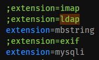
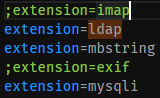
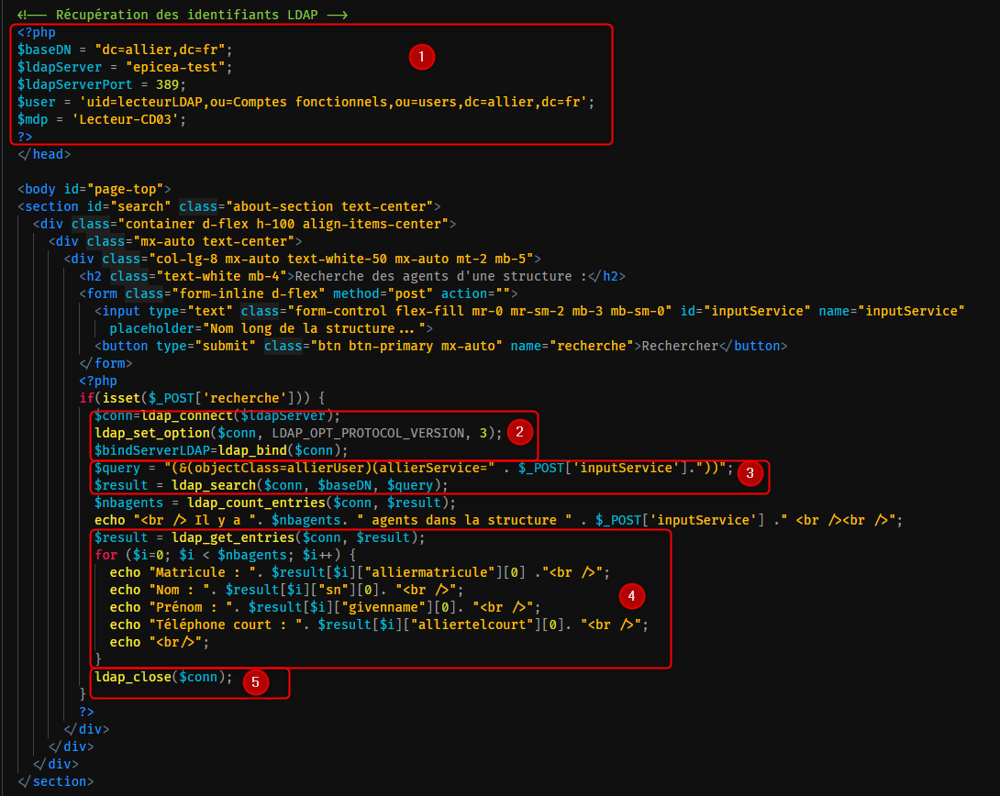

## Guide pour l'utilsation d'Apache Directory Studio - [ICI](<./Procédure pour débuter.html>)

# Guide pour pour mise en place dans un environnement PHP :

### Exemple de recherche dans un environnement PHP - [ici](http://epicea-test/OpenLDAP/search.php)

**Configuration de l'environnement de travail :**

- Activer la prise en charge de la librairie LDAP dans votre fichier php.ini 

 ==> 

Voici le code de la page PHP présentée au dessus :

1. Saisie des identifiants de connexion - Sur la capture d'écran, on peut voir **baseDN="dc=allier,dc=fr"** on aurait très bien pu mettre : **baseDN="ou=users,dc=allier,dc=fr"**
2. Dans cette partie, nous avons **deux** commandes importantes :
- **ldap_connect** pour la connexion à l'annuaire OpenLDAP [+ d'infos ici](https://www.php.net/manual/fr/function.ldap-connect.php)
- **ldap_bind** pour l'authentification au serveur LDAP [+ d'infos ici](https://www.php.net/manual/fr/function.ldap-bind.php)
3. La partie **query** ne vous rappelle rien ? 😉
> Si cela ne vous dit rien, je vous invite à aller voir le [premier guide](<./Procédure pour débuter.html>) en recherchant "filtre"
3. ***(suite)*** **ldap_search** permet de lancer la recherche [+ d'infos ici](https://www.php.net/manual/fr/function.ldap-search.php)
4.  Dans cette section, **ldap_get_entries** permet d'afficher les resultats [+ d'infos ici](https://www.php.net/manual/fr/function.ldap-get-entries.php)

> Au niveau du **echo "Matricule : " .\$result[$i]["alliermatricule"][0]**
> - On veut afficher la première entrée **`[0]`** du matricule agent **`["alliermatricule"]`** *(Oui, je sais c'est pas logique ...)*
> Pareil pour les autres attributs que l'on veut retourner
5. Pour terminer, **ldap_close** permet de fermer la connexion ldap [+ d'infos ici](https://www.php.net/manual/fr/function.ldap-close.php)

N'hésitez pas à tester et revenir vers moi pour toute question 😉