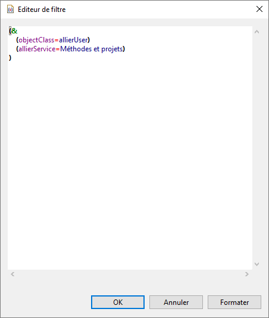

## Guide pour mise en place dans un environnement PHP - [ICI](<./Procédure pour PHP.html>)

# Guide pour l'utilisation d'Apache Directory Studio :

**Configuration de l'environnement de travail :**

*Apache Directory Studio :*

Il faut récupérer soit l'installation soit la version portable :

>`L:\MP\1. Solutions métiers\Pôle CAC\OpenLDAP - Dev Interne - Annuaire OpenLDAP\090. Déploiement-Installation\Périmètre de déploiement\`

OU

En suivant le lien suivant [Apache Directory Studio](https://directory.apache.org/studio/download/download-windows.html)

----

Une fois l'instation terminée, il faut lancer Apache Directory Studio.

N'oubliez pas d'ouvrir le fichier de configuration, on va en avoir besoin ...

*Mais où est-il ?!*

Pas de panique !!

Il est là --> 
> `L:\MP\1. Solutions métiers\Pôle CAC\OpenLDAP - Dev Interne - Annuaire OpenLDAP\090. Déploiement-Installation\Périmètre de déploiement\configuration.txt`

Il faut alors déclarer une nouvelle connexion :

1. Le nom de la connexion (***UnSuperNomPourCetteConnexionOpenLDAP***)
2. Le lien du serveur ***(epicea-test***)
3. Puis, Suivant

1. Bien séléctionner Authentification simple
2. Le nom d'utilisateur (***uid=lecteurLDAP,ou=Comptes fonctionnels,ou=users,dc=allier,dc=fr***)
3. Le mot de passe (***Lecteur-CD03***)
4. Puis, Terminer

---

**Navigation dans la structure :**

En dépliant les petits chevrons (sous **ou=users**), on trouve les différentes structures de notre organigramme hiérarchique.

1. Une structure de type **allierOU**
2. Un poste de type **allierPoste**
3. Un agent de type **allierUser**

*Vous pouvez aller voir le schéma si vous ne me croyez pas* 😉

> `L:\MP\1. Solutions métiers\Pôle CAC\OpenLDAP - Dev Interne - Annuaire OpenLDAP\090. Déploiement-Installation\Livraisons-Sources\Schémas\Dernière version\allier.schema`

---

**Passons aux recherches :**

- Création d'une nouvelle recherche :

1. Clic droit sur **Recherches**
2. **Nouveau**
3. **Nouvelle recherche...**

*Devais-je vraiement présenter cette étape ...*

- Création de la **vraie** recherche - **Tous les agents de chez MP** :

1. Le nom de la recherche (***TousLesAgentsDeChezMP***) si on ne met rien, il utilse la date et heure de création ... pas simple pour s'y retrouver quand on en a beaucoup ...
2. La base de recherche est le niveau où débute la recherche (***ou=users,dc=allier,dc=fr***)
3. Le filtre mérite un peu plus d'explication :

On demande ici les entrées avec la valeur **allierUser** dans l'attribut *objectClass*  **ET**  la valeur **Méthodes et projets** dans l'attribut *allierService*

On peut faire des associations de filtres avec les opératieurs **AND** / **OR** / **NOT** :

>- **AND** ==> (& )
>- **OR** ==> (| )
>- **NOT** ==> (! )

4. Les attributs retournés sont les champs que l'on veut voir.
5. Ce qui nous donne :

On va faire une autre recherche :

On veut, tous les agents de MP (*Quoi ! Encore ?!*), 

Attends !

On veut, tous les agents de MP **sans le responsable**

*Alors, une idée ?*

*Je dis rien mais, on l'a vu plus haut !*

Si on ne connais pas le matricule, on peut aussi faire ceci :
> (!(sn=GRAS))

Ce qui nous donne :

N'hésitez pas à tester et revenir vers moi pour toute question 😉